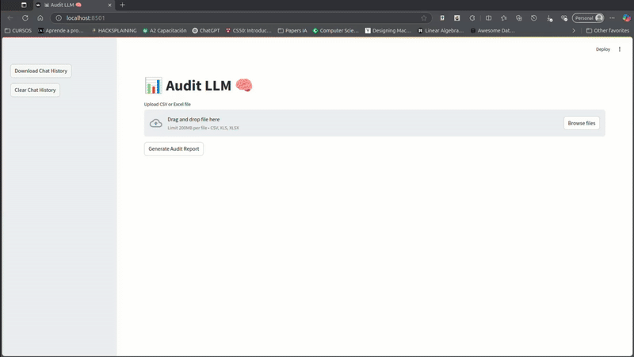
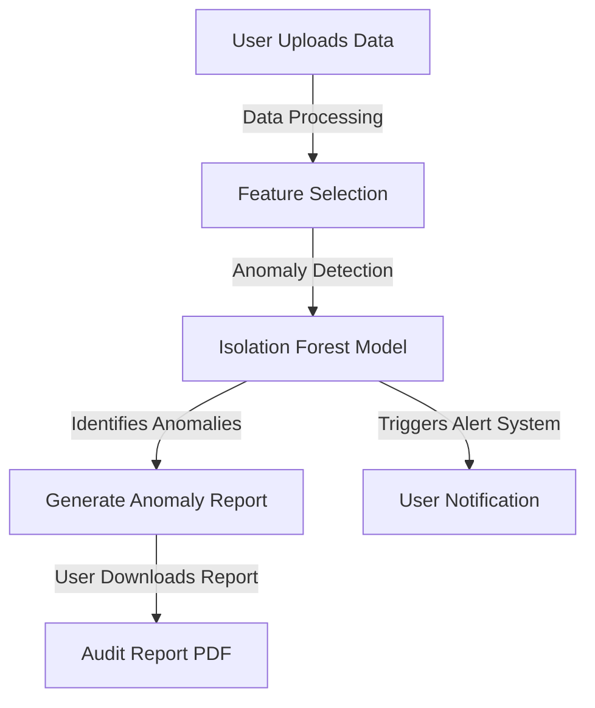

# 📊 Financial Anomaly Detection with DeepSeek and Isolation Forest 🧠



## 🚀 Project Overview
Audit LLM is a powerful, locally-run data analysis and anomaly detection tool designed for businesses to ensure data integrity. It provides:

- **📈 Anomaly Detection** using **Isolation Forest** and other methods.
- **📝 Automated Audit Report Generation** in **PDF** format.
- **🔍 Interactive Time-Series Visualization** with **Plotly**.
- **📂 Local Database Storage** for chat history and insights.
- **💡 LLM-powered Q&A** on datasets using vector-based retrieval.

## 🌟 Features

### 🔬 Advanced Anomaly Detection
- **Detect anomalies** in structured datasets using advanced techniques.
- Implements **Isolation Forest**, a cutting-edge anomaly detection algorithm.
- Automatically **highlights outliers** in time-series data.
- Supports **interactive visualization** of anomalies.

### 📊 Data Analysis & Visualization
- Supports **CSV and Excel** file uploads.
- **Detects time-series columns** and allows dynamic filtering.
- Aggregates data **daily, monthly, or yearly**.
- **Plots normalized time-series graphs** with detected anomalies.

### 📝 AI-Generated Audit Reports
- Generates **detailed, professional audit reports** in **PDF format**.
- Summarizes detected anomalies and **explains business impact**.
- Includes **anomaly scores, distribution insights, and recommendations**.
- Provides an **interactive preview** before downloading the report.

### 🎥 Live Demo
For a full demonstration of the application's functionality, watch the video below:

[](https://www.youtube.com/watch?v=2o359RqFSfQ)

---

### 🤖 AI-Powered Dataset Q&A
- Uses **HuggingFace Embeddings** and **FAISS** for fast vector search.
- Retrieves **relevant document context** for LLM-based answers.
- Supports **DeepSeek LLM** for intelligent responses.
- Saves all **Q&A interactions in a local SQLite database**.

### 💾 Persistent Chat History & Data Integrity
- Stores chat history in **SQLite** to **retain insights across sessions**.
- Provides **downloadable chat history**.
- Offers a **"Clear Chat History"** button to maintain privacy.

## 🔁 Application Workflow


## 📖 What is Isolation Forest?
**Isolation Forest** is an anomaly detection algorithm that isolates anomalies through recursive partitioning:
- **Randomly selects features** and splits values.
- Anomalies are **isolated faster**, requiring fewer splits.
- Unlike traditional distance-based methods, it **efficiently detects outliers in high-dimensional data**.
- **Fast, scalable, and works well with large datasets.**

## 🛠️ Notes

> **Note**: Useful information that users should know, even when skimming content.
> 
> **Tip**: Helpful advice for doing things better or more easily.
> 
> **Important**: Key information users need to know to achieve their goal.
> 
> **Warning**: Urgent info that needs immediate user attention to avoid problems.
> 
> **Caution**: Advises about risks or negative outcomes of certain actions.

## 🎯 Use Cases
✅ **Fraud Detection** - Identify irregularities in financial transactions.
✅ **Operational Risk Management** - Monitor business processes for failures.
✅ **Data Quality Assurance** - Detect inconsistencies in large datasets.
✅ **Supply Chain Anomalies** - Analyze logistics data for disruptions.
✅ **IoT Monitoring** - Identify device failures or security threats.

## 📎 Cool Features for GitHub README
- **🔥 Interactive Streamlit App** with real-time visualization.
- **📥 Downloadable PDF Reports**.
- **💡 AI-powered Insights** using **DeepSeek & FAISS**.
- **🛠️ Fully Open-Source** and **Customizable**.

## 🤝 Contributing
1. **Fork** the repository.
2. **Create a branch** (`feature-branch`).
3. **Commit changes**.
4. **Open a Pull Request**.

## 📜 License
This project is licensed under the **MIT License**. If you use this project, please provide appropriate credit by citing **jabonsote**.

## 📢 Citation
If you use **Audit LLM** in your research, projects, or publications, please cite it as follows:

```
@software{audit_llm,
  author = {jabonsote},
  title = {Financial Anomaly Detection with DeepSeek and Isolation Forest},
  year = {2025},
  url = {https://github.com/jabonsote/audit-llm}
}
```

## 📬 Contact
For questions or suggestions, reach out via GitHub Issues!

---

🎯 **Financial Anomaly Detection with DeepSeek and Isolation Forest** – Empowering businesses with **data integrity & anomaly detection!** 🚀

